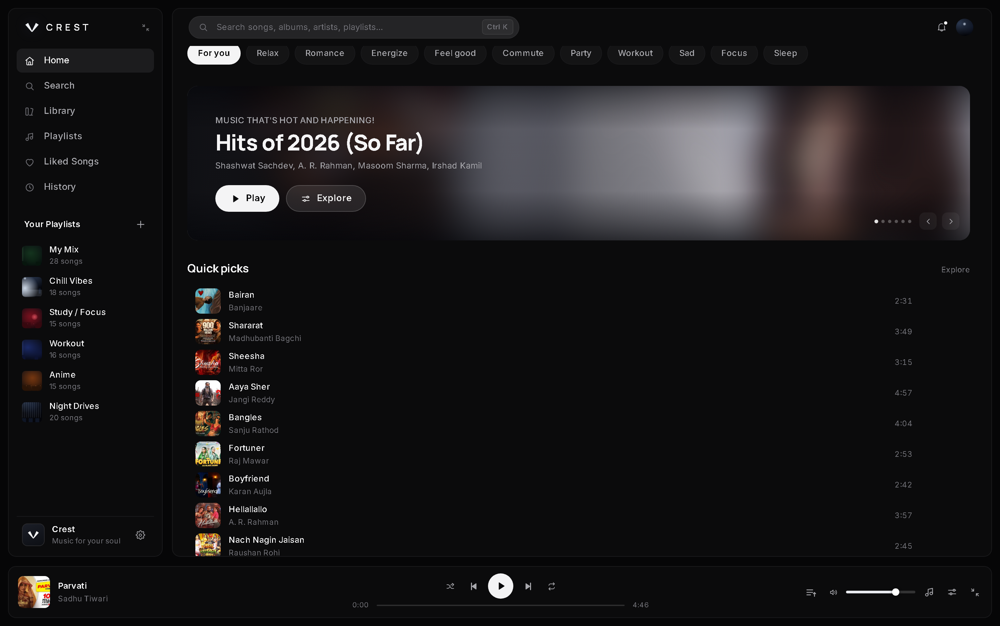
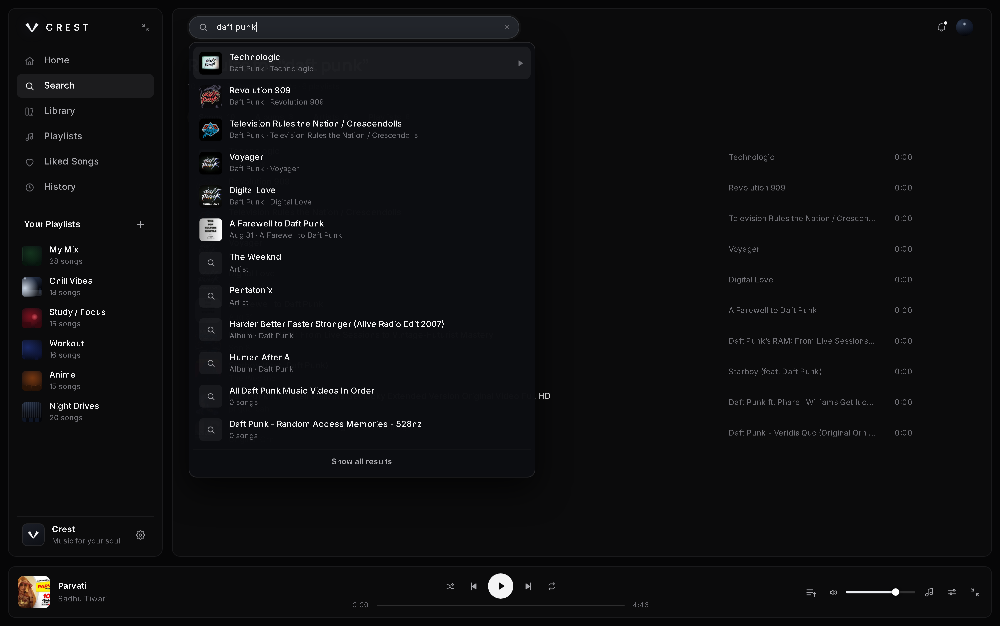
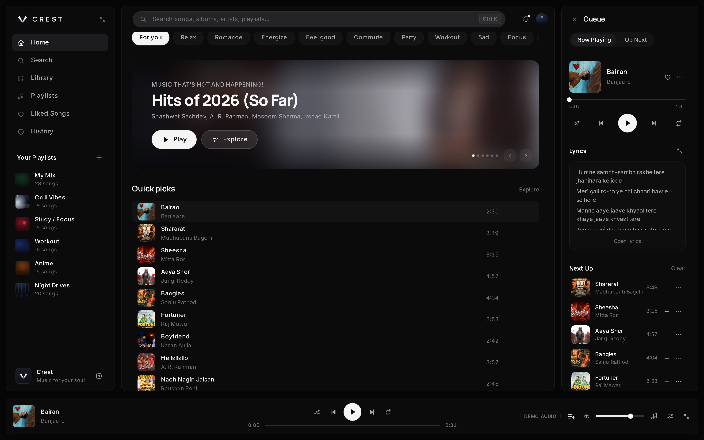
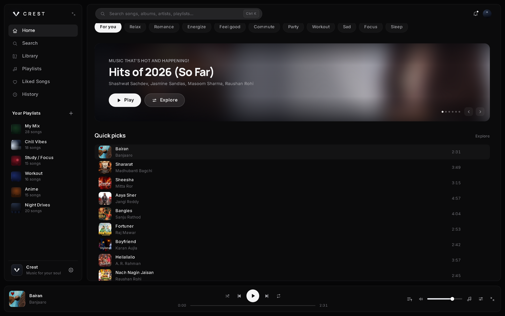
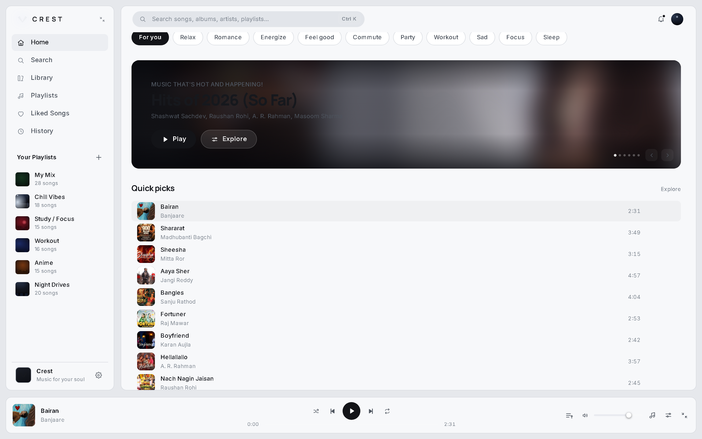
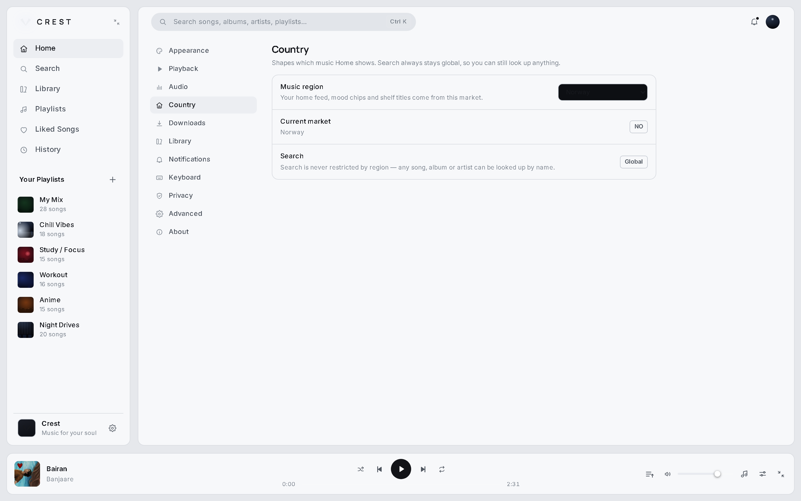

# Crest

**Codename: Nabito** — a lightweight Windows desktop music client.

A frameless, dark-by-default music client for Windows 10/11, built on Tauri 2 + React 19 +
TypeScript. It streams **full-length audio from YouTube Music** through a small local helper
process, ships as a single ~40 MB installer, and uses the OS webview instead of bundling a
browser.

---

## Contents

- [Screenshots](#screenshots)
- [What it does](#what-it-does)
- [Install](#install)
- [Running it from source](#running-it-from-source)
- [Stack](#stack)
- [Architecture](#architecture)
- [How playback actually works](#how-playback-actually-works)
- [Reliability notes](#reliability-notes)
- [Design system](#design-system)
- [Keyboard](#keyboard)
- [Licensing & content](#licensing--content)

---

## Screenshots

### Noir — the default

<p align="center">
  
  <br /><sub>Home — mood rail, hero carousel and quick picks built from the live YouTube Music feed.</sub>
</p>

<p align="center">
  
  <br /><sub>Search — tracks, albums, artists and playlists. Always global, never restricted by region.</sub>
</p>

<p align="center">
  
  <br /><sub>Queue — now playing, synced lyrics and an up-next list that refills itself as it drains.</sub>
</p>

### Country-aware feed

Home is localised to a country you choose in **Settings → Country**. The interface stays
English — only the *music* changes. This is the same app with South Korea selected:

<p align="center">
  
  <br /><sub>Region KR — a different market's feed, charts and picks. Chrome stays English.</sub>
</p>

### Glacier — the light theme

<p align="center">
  
  <br /><sub>Glacier — the daylight preset. One of three themes, all built from CSS variables.</sub>
</p>

<p align="center">
  
  <br /><sub>Settings → Country — 61 markets, or Automatic. Changes the feed immediately and persists.</sub>
</p>

---

## What it does

| | |
| --- | --- |
| **Real audio** | Full-length tracks stream from YouTube Music. Not previews, not demos. |
| **Real home feed** | Built from YouTube Music's own editorial shelves and mood chips — not a text search dressed up as a feed. |
| **Country-aware** | Pick one of 61 countries and Home returns that market's music. The interface stays English. |
| **Global search** | Any song, album, artist or playlist by name, regardless of region. |
| **Radio queue** | The queue refills itself from per-track recommendations and stays wide — no three songs by one artist. |
| **Pre-resolved audio** | The next track's stream is resolved while the current one plays, so skipping is instant. |
| **Honest errors** | When something fails, it says what actually failed. |
| **Auto-shutdown helper** | The local helper exits by itself ~15 s after the app closes. Nothing lingers. |

---

## Install

Download `Crest_<version>_x64-setup.exe` from the
[Releases page](../../releases) and run it.

The installer is a standard NSIS package. It creates a `Crest` folder containing five files:

```
Crest/
  crest.exe                        the app        (3.6 MB)
  helper/mediaHelper.bundle.mjs    the backend   (1.6 MB)
  node.exe                         runtime       (90 MB)
  yt-dlp.exe                       stream resolver (17 MB)
  uninstall.exe                    uninstaller
```

Nothing to install alongside it — no Node, no Python, no API keys. `node.exe` is bundled
because the media helper is a real local process; it is the bulk of the install size and is a
known trade-off of using Tauri rather than rewriting the backend in Rust.

**Requirements:** Windows 10/11 x64, and an internet connection (all music comes from YouTube).

---

## Running it from source

```bash
npm install
npm run dev            # browser preview at http://127.0.0.1:5273 — fast visual loop
npm run desktop        # Tauri dev window
npm run build          # typecheck + production frontend build
npm run desktop:build  # NSIS installer → src-tauri/target/release/bundle/nsis/
npm run icons          # regenerate the app icons (stdlib-only Python script)
```

The dev server starts the media helper for you. To regenerate the helper bundle after changing
anything in `server/`, run `npm run helper:bundle`.

Screenshots in this README are generated by `node tools/shots.mjs` (requires `npm run dev`
running). It drives a headless Edge over CDP so the captures match the desktop build.

---

## Stack

| Layer | Choice | Why |
| --- | --- | --- |
| Shell | **Tauri 2** (Rust) | Uses the OS webview (WebView2, already on Windows 10/11) instead of shipping a browser. Idle RAM measured in tens of MB versus hundreds for Electron. Tray, notifications, single instance and window state are all reachable from Rust. |
| UI | **React 19 + TypeScript** | Strict types across a 60+ component surface. No UI kit — every control is written to match the design rather than a library's default look. |
| Build | **Vite 8** | Sub-second HMR, small chunk-split production bundles. |
| State | **Zustand** (~1 kB) | Store-per-domain with selectors. Playback position deliberately lives *outside* React. |
| Audio | **`<audio>` behind an `AudioEngine` interface** | Real playback now; a native Rust pipeline drops in behind the same interface later. |
| Storage | localStorage through one adapter | Settings, library, queue and history persist today; the adapter is swappable without touching call sites. |
| Metadata | **youtubei.js** | YouTube Music's InnerTube API, no official SDK, no API key. |
| Audio resolution | **yt-dlp** | Resolves the direct stream URL per track. |

---

## Architecture

```
src/
  app/            shell composition, router, appearance, error boundary
  components/     ui/ (primitives) · layout/ (chrome) · music/ (cards, tables) · dev/
  pages/          one folder per view; home/ holds the hero + feed
  player/         PlayerBar, controller, player store
  audio/          AudioEngine contract + HTML and simulated implementations
  queue/          queue panel and rows
  search/         search hook + page
  services/       providers/ — MusicProvider contract and implementations
  store/          settings, library, ui, player stores (persisted where appropriate)
  settings/       settings primitives (rows, toggles, segmented, selects)
  library/        track resolution cache
  hooks/          hotkeys, debounce, async, visibility
  windows/        the only module that talks to Tauri
server/
  mediaHelper.mjs local HTTP helper (the backend)
  mediaCore.mjs   yt-dlp resolution + caching
  ytmusic.mjs     search, albums, artists, playlists
  home.mjs        home feed, moods, related tracks, radio
  quality.mjs     anti-slop curation filters
  innertube.mjs   the single shared Innertube session (+ region)
  regions.mjs     country table
src-tauri/        Rust shell (window state, spawning the helper)
tools/            screenshot driver (not part of the app)
```

Hard rules enforced by this layout:

- **UI never touches Tauri directly** — everything goes through `src/windows/tauri.ts`, which
  no-ops in a browser so `npm run dev` gives a fast visual loop.
- **UI never touches a backend directly** — it consumes `MusicProvider` only.
- **Player never touches `<audio>` directly** — it drives an `AudioEngine`.

### The media helper

The UI cannot reach YouTube directly from a webview, so a small Node process does it. `crest.exe`
starts it on `127.0.0.1:5267` at launch, and it serves:

| Endpoint | Purpose |
| --- | --- |
| `/home?mood=&region=` | Editorial feed, mood chips and quick picks for a country |
| `/search-all?q=` | Global search across all four categories |
| `/track`, `/album`, `/artist`, `/playlist` | Metadata |
| `/related`, `/radio` | Per-track recommendations and the radio queue |
| `/audio?vid=` | Range-proxy for the resolved stream |
| `/prewarm?vid=` | Resolve a track's audio ahead of time |
| `/health` | Heartbeat — the helper exits if this stops |

It is a **local** process on your own machine. It is never hosted, and it is not on the internet.
The webview heartbeats it every 5 s; miss the window and it shuts itself down.

---

## How playback actually works

1. The player asks the provider for a stream.
2. `getStream()` waits for the helper to be listening, then requests two bytes of audio to prove
   the track resolves *before* handing a URL to the media element.
3. On success the URL is `http://127.0.0.1:5267/audio?vid=…`, which range-proxies googlevideo so
   seeking works and nothing touches disk.
4. While a track plays, the next one is resolved in the background (`/prewarm`), which turns a
   ~5 s wait into ~0.05 s.

Because step 2 happens before playback is attempted, a track that cannot stream produces a real
explanation instead of the media element's generic "no supported source".

**Player clients.** YouTube bot-gates yt-dlp's default player client from many networks. Crest
tries `web_embedded` first — which is not behind that check — and falls back through the others,
remembering whichever worked last.

---

## Reliability notes

Things that are honestly limited, and how the app behaves:

- **YouTube rate-limits by IP.** When a network is throttled, streams return 403. Crest backs
  off, retries with a fresh URL, and then stops trying for 30 s rather than hammering and making
  it worse. The player says *"YouTube is rate-limiting this network"* and offers Retry — it does
  not pretend the track is broken.
- **Country is not a VPN.** The selected market changes which music, charts and picks come back,
  but YouTube still sees your real IP, so chart *positions* can lean toward where you actually
  are. The interface itself is always English — a Korean feed in Korean chrome reads as a bug,
  not a feature.
- **Non-English text is filtered out of the interface.** Shelf headings, playlist cards and hero
  titles must be English, so anything in another script is skipped rather than shown. **Song
  titles are exempt** — "Kya Mujhe Pyar Hai" is a real song and appears exactly as written.
- **Search is never regional.** Any song can be found by name from any region setting.
- **Personal-use pipeline.** Unofficial YouTube endpoints are subject to silent breakage and are
  not covered by any API contract. See [docs/PROVIDERS.md](docs/PROVIDERS.md).

---

## Design system

Values were sampled from the reference and encoded as tokens in `src/styles/tokens.css`.

| Measurement | Value | Token |
| --- | --- | --- |
| Window frame / canvas | `#070A0E` | `--canvas` |
| Panel interior | `#04050A` | `--panel` |
| Sidebar width | 232 px | `--sidebar-w` |
| Queue width | 292 px | `--queue-w` |
| Top bar height | 56 px | `--header-h` |
| Player height | 78 px | `--player-h` |
| Panel gutters | 12-14 px | `--window-pad`, `--gutter` |
| Active nav pill | 36 px, `#15181D`, r8 | `--surface-2` |
| Radii / borders | r8-r12, hairline `#14161C` | — |

Typography: **Manrope** for display, **Inter** for UI and body. Both self-hosted, latin subset
only, variable weight — **73 kB total**, no webfont CDN, works offline.

**Themes** — Noir (black, default), Midnight (deep blue) and Glacier (daylight white), all built
from the same CSS variables. Settings → Appearance also has a custom-token editor for your own
palette.

**Performance** — no polling: playback position is written to the DOM from a frame loop that only
exists while audio is playing. Long lists are virtualised, artwork loads lazily behind a gradient
placeholder, and rows use `content-visibility: auto`.

---

## Keyboard

| Shortcut | Action |
| --- | --- |
| `Ctrl+K` | Focus search |
| `Space` | Play / pause |
| `Ctrl+←` / `Ctrl+→` | Previous / next track |
| `M` | Mute |
| `↑` / `↓` | Volume |
| `Esc` | Close menu / overlay / dialog |
| `Alt+↑` / `Alt+↓` | Reorder the focused queue row |

Letter and arrow shortcuts stand down while you are typing in a field.

---

## Licensing & content

- **Fonts**: Inter and Manrope, SIL Open Font License 1.1 (`public/fonts/LICENSE-*`).
- **Icons**: hand-drawn inline SVG (`components/ui/Icon.tsx`) — no icon package.
- **Artwork** comes from YouTube and belongs to whoever made it.
- **Lyrics** come from LRCLIB.
- **Music** streams from YouTube. Crest ships no audio, downloads nothing to disk, and is
  intended for personal use. It is not affiliated with or endorsed by YouTube.

See [docs/PROVIDERS.md](docs/PROVIDERS.md) for the full provider and terms discussion.